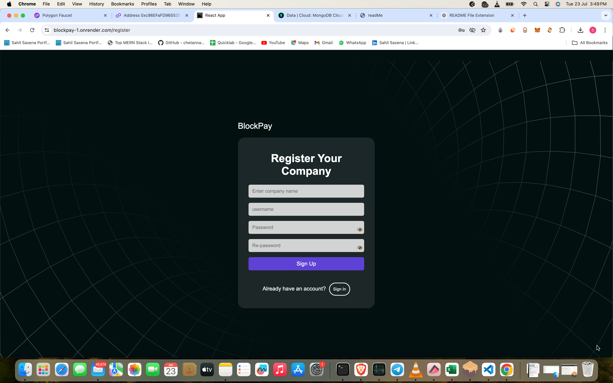
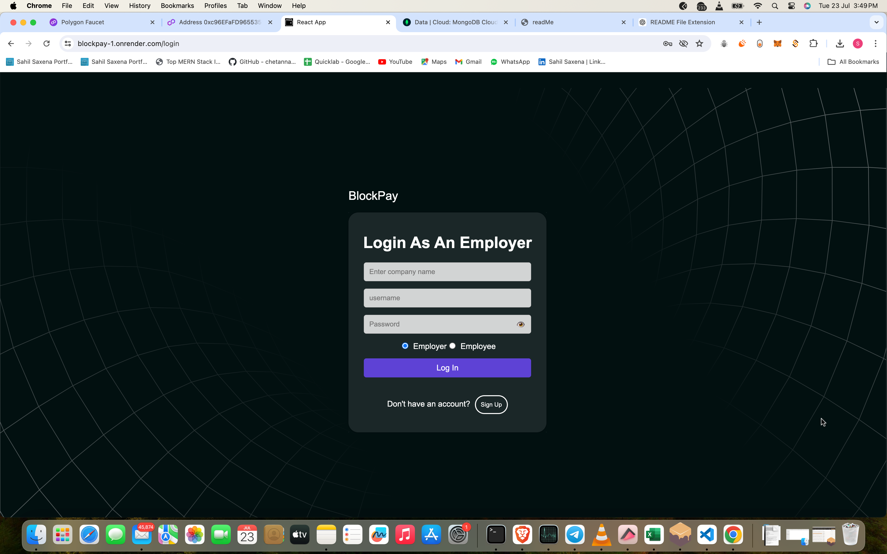

# BlockPay

BlockPay addresses the pressing challenges in payroll management for
global businesses. By leveraging blockchain technology, BlockPay
reduces transaction costs, automates tasks, enhances transparency,
speeds up payments, ensures compliance, secures data, improves
efficiency, boosts employee satisfaction, scales easily, and provides
real-time insights. BlockPay transforms payroll management with the
unique feature of paying an entire global workforce in a single
transaction empowering businesses to operate more effectively and
efficiently.

## Table of Contents

- [Features](#features)
- [Tech Stack](#tech-stack)
- [Installation](#installation)
- [Usage](#usage)
- [Contributing](#contributing) - [License](#license)
- [Team](#team)
- [Contact](#contact)

## Features

- **Global Payouts in One Click**: Pay your entire global workforce in a
  single transaction.
- **Cost Reduction**: Reduce costs associated with international bank
  transfers and eliminate third-party payroll services.
- **Automation Compliance**: Automate payroll processes to ensure
  compliance with minimal human interference.
- **Transparency and Trust**: Blockchain technology ensures transparent
  and immutable transaction records.
- **User-Friendly Dashboards**: Separate dashboards for admin and
  employees to enhance user experience.

## Tech Stack

- **Blockchain**: Polygon, Solidity
- **Front-End**: React js, HTML, CSS, JavaScript, MaterailUi
- **Back-End**: Node.js, Express.js, MongoDB
- **Database**: MongoDB
- **Tools**: VsCode, MongoDB Cloud
- **Deployment**: Polygon Cardona Test Network

## Installation

1. **Clone the repository**

```bash
git clone https://github.com/sahil58555/BlockPay.git 
cd blockpay
```

2. **Configure environment variables**
   Create a `.env` file in the root directory and add the following:

```DB_URI_DEV=your_monodb_uri
PRIVATE_KEY=your_private_key MONGODB_URI=your_mongodb_uri
JWT_SECRET_KEY=your_key
MEMONICS=your_memonics
WALLET_ADDRESS=your_wallet_address
IS_PROD=false
```

3. **Start backend server**

```
npm install
npm start
```

4. **Start Frontend**

```
cd Front-end
npm install
npm start
```

5. **Access the application**
   Open [http://localhost:3000](http://localhost:3000) in your browser.

## Contributing

We welcome contributions from the community! To contribute:

1. **Fork the repository**
2. **Create a new branch** (`git checkout -b feature/your-feature`)
3. **Commit your changes** (`git commit -m 'Add your feature'`)
4. **Push to the branch** (`git push origin feature/your-feature`)
5. **Create a Pull Request**

## Screenshots



**Figure 1:** Register Page



**Figure 2:** Login Page


**Figure 3:** HR Dashboard Page


**Figure 4:** Add Employee Page


**Figure 5:** Finance Page


**Figure 6:** Employee Dashboard Page

## License

This project is licensed under the MIT License - see the [LICENSE]
(LICENSE) file for details.

## Team

- **Vaibhav** - Project Lead
- **Sahil** - Web2, Web3 developer
- **Ananya** - UI/UX Designer
- **Sarthak** - Front-End Developer

## Contact

For any inquiries or questions, please contact us at
[contact@blockpay.com] (mailto:contact@blockpay.com)
